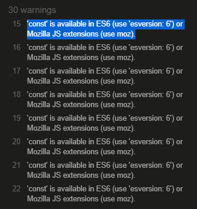

# Angus Friel

## Project-Name: The Simpsons Memory Game

[View Deployed Site Here](https://ajfriel86.github.io/TheSimpsons)

## UX

### Ideal Client
_The ideal client will be:_

* Has English as a language
* Enjoys games
* Likes to try new games
* Has basic computer knowledge 
* Is competitive 

### Website user will be searching for:

* Easy online games to play
* Time to kill

### This website will aid them because of the following

* Provides an easy to play game that will elevate boredom
* Provides enjoyment
* Encourages competitiveness with oneself

### Client Stories

* A user must be able to navigate the site easily.
* A user must be able to have game rules to understand thwe concept of the game.
* A user will be met with a grid styled game with pictures on front and back of the cards. 
* The timer is actrivated once the user begins the game by flipping the first card.
* Once a second card is flipped the moves counter increments by one, weather or not the cards match
* Once all cards are matched, the timer will end, and a winner’s message will appear displaying a message with how many moves it took the user to win and in how many seconds / minutes it took them
* The game will automatically reset once all cards are matched. 
* The user should be able to reset the game with a button.
  
## Features
The website will consit of one page with a title "The Simpsons Memory Game," a grid of 12 cards, and two buttons. One on how to play the game and the other to reset the game.

The moves counter will only increment when the second card hass been flipped and the timer will only commence after the first card is fillped and will end once are cards are matched. 

The "Game Rules" button will active a pop-up message displaying the concept of the game. This will will have a button "Play the Game," this will exit the Game Rules pop uo and take the user back to the game so they can play it. 

The reset button will only reset the game after a move has been made. This will also reshuffle the cards.

### Colour Scheme
The Colour scheme from the website used the Simpson colour pallet I found from the following website: 

[Color-hex](https://www.color-hex.com/color-palette/12626)

### The Landing Page
This is the one and only page for the JavaScript memeory card game I developed. It is the first thing the user sees when they land on the website. It meets all the user story criteria. A grid-based memory card game, a button with game rule, a reset button to reshuffle and restart the game, a timer, and a moves counter. 

### Game Rules
To display the concept and rules of the game, I designed a pop that would display the require content once a button was clicked. 

Once the button was clicked the content would then be displayed, like so:

## Testing
I made a short video of the game while I ran through it testing it for bugs and its palyability and aesthetchics. 

I was testing the game to see if it would let me turn more than two cards at a time, it would not. So that test was a success. I then tested the games buttons, and both worked correctly. Even the "Play the Game" button within the game’s rules pop up worked correctly. I also tested hte game to the end to see if the winners message popped up, which it did. THen I tested the close button on the winner’s message and that also worked correctly. 

While testing the website in W3 and Jigsaw I had some very minor errors. My backdrop-filter was not being recognised and causing me errors, so I removed it altogether. It made the background image of the donut look a bit cleaner with the text over it but, it wasn't an essentail piece so, I removed it to combat this error. 

While testing my HTML code I found to have no errors:

While testing my JavaScript on JSHint I found 30 warnings but, realised that I had to check the box in the configure panel. This reduced my warnings to one. 

30 Warnings: 

Configure Menu to check boxes:

Down to one warning: 

## Bugs
I found a few bugs due to human error. I named some varibles, classes and id's wrong, or got my classes and id's mixed up. But once I corected these everything worked the way it should. 

I also found some spare closing div tags that I didn't need and so, deleted these. 

## Technologies used
The technologies used for the contruction of this site are as follows: 
* [HTML](https://en.wikipedia.org/wiki/HTML) - This was used to contsruct the website, as it it used as markup language to display content of a website. 
* [CSS](https://en.wikipedia.org/wiki/CSS) - This was used to style the content of the website.
* [JavaScript](https://en.wikipedia.org/wiki/JavaScript) - This was used to create the interactivity of the game re: the cards, timer, and moves counter. As well as the popup for the game rules and the reset button, to reset the game. 
* [Google Fonts](https://fonts.google.com/) - This was used to get the require font that the content is written in.
* [GitPod](gitpod.io) - This was used as an IDE, or the Intergrated Development Area, where the HTML, CSS and JavaScritp where all written in the required file types in oder to display the website. 
* [GitHub](https://github.com/) - this was used to host the website, so it is viewable to the public.

## Deployment

This website was contructed in GitPod and deplopyed on GitHub. The steps taken to deploy this website from its [GitHub Repository](https://github.com/Ajfriel86/TheSimpsons) are as folows: 

* Log into GitHub
* Go to the list of repositories on the left-hand side of the screen.
* Click on the repository - Ajfriel86/TheSimpsons
* Choose the settings tab froim the menu items across the top of the page; it is the ninth choice and last option on the menu items.
* Once the settings page has loaded scroll down to GitHub Pages.
* In the source section, choose the master branch.
* On selecting this the page is automatically refreshed and the website is deployed.
* A link to the website is then diplayed, this is the deployed websites website address.    

## Credits
### Content
The content of this website was written by Angus Friel. 

### Media
The images used on the website where sourced from google images or from icon archive:

### Code
The html and css code I used to construct this website are from past learning outcomes from my previous courses and from what I have learned at the Code Insitiute. THe JavaScript I used for this project was incroprated from past courses I have taken, as well as from tutorials I have mentioned in my acknowledgemnts, and from what I have learned at the Code Insitiute. 

### Acknowledgements

Here is the first site I encountered about a memory card game. This website gave me the idea for the basis of the website that I constructed for this project:
[Free code camp](https://marina-ferreira.github.io/tutorials/js/memory-game/)

It also had a video with a walk through on how to construct it:
[Memory Card Game - JavaScript Tutorial](https://www.youtube.com/watch?v=ZniVgo8U7ek)

I then went further with the idea and incorporated some of the elements from this tutorial:
[Stocth - JS memeory game](https://scotch.io/tutorials/how-to-build-a-memory-matching-game-in-javascript)

I also found this YouTube video very helpful:
[Card Matching Game/Memory Card Game in JavaScript](https://www.youtube.com/watch?v=Y4lOwOOK7yE)

#### Disclaimer
The content of this Website is for educational purposes only.